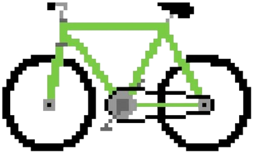
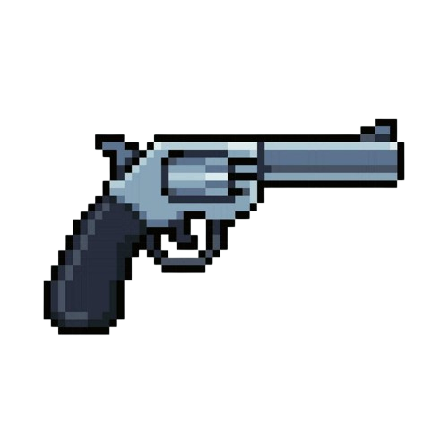
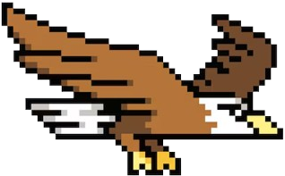

# 🚀 E.T. — The Adventure  Game

**E.T. — The Adventure** is a pixelated browser game inspired by the legendary alien himself. Play as E.T. as he dodges danger, collects power-ups, and races toward the stars — all wrapped in a retro 8-bit style made for nostalgic fun.

---

## 🎨 Pixelated Design

Every visual in this game was handcrafted in a **retro pixel art style** to capture the charm of early 80s games. The background, E.T. sprite, power-ups, and even the evil items falling from the sky were designed to feel like they belong on a vintage arcade screen.

---

## 🧩 Gameplay Overview

The goal is simple: **catch helpful items, avoid harmful ones, and level up your XP bar to reach 3000**. Sounds easy? Think again — not everything falling from the sky is your friend...

---

## 🧪 XP Bar

Your current progress is shown in the **XP bar** at the top of the screen:

- Catching **good items** increases your XP.
- Catching **evil items** will set you back!
- Reach **3000 XP** to win the game.

XP progress is visually tracked with a sleek rocket that travels along the XP bar.

---

## 🎨 Power-Ups

### 🚲 Bicycle  
  
- **Effect**: Temporarily boosts E.T.'s speed and sets his feet ablaze with pixelated fire.  
- **Duration**: 10 seconds  

### 🌺 Flowers  
  
- **Effect**: Grants E.T. a glowing shield bubble.  
- **Benefit**: Blocks evil items and doubles XP from good ones.  
- **Duration**: 10 seconds  

---

## ⚡ Evil Items

These items must be avoided!

### 🔫 Gun  
  
- **Effect**: Decreases XP by 100 unless E.T. is shielded.

### 🎃 Halloween Pumpkin  
  
- **Effect**: Also decreases XP unless protected.

### 🦅 Eagle  
  
- **Effect**: If E.T. is unshielded, the game ends immediately with a surprise ending.

---

## 🔍 Legal & Disclaimer

This is a **fan-made project** with no affiliation to Universal Studios or any rights holders of the E.T. franchise.

> **This game is for educational, creative, and entertainment purposes only. No commercial use, profit, or distribution intended.**

All trademarks, characters, and original references to "E.T. the Extra-Terrestrial" belong to their respective owners.

---

## 💻 How to Play

- Use **arrow keys** to move E.T. left and right.  
- Catch good items to gain XP.  
- Avoid evil items (unless you have the shield!)  
- Reach 3000 XP to win the game and see E.T. fly home!

---

## ✨ Made With Love

This game was coded and designed using **HTML**, **CSS**, and **JavaScript**, and lives on **GitHub Pages**.

---

Want to see the code? [Click here to view the repository](INSERT-GITHUB-REPO-LINK).

Enjoy the ride, and remember: **(Be) Good.**
