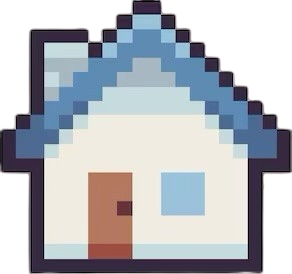
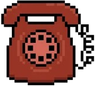
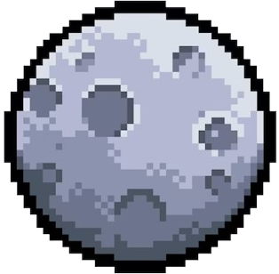
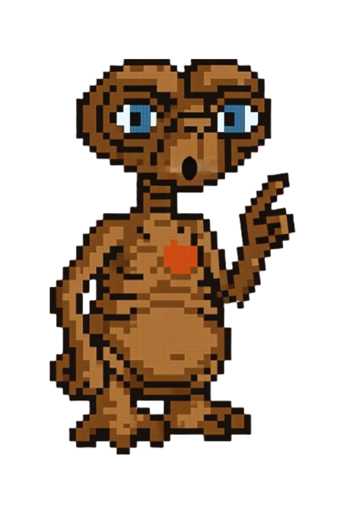
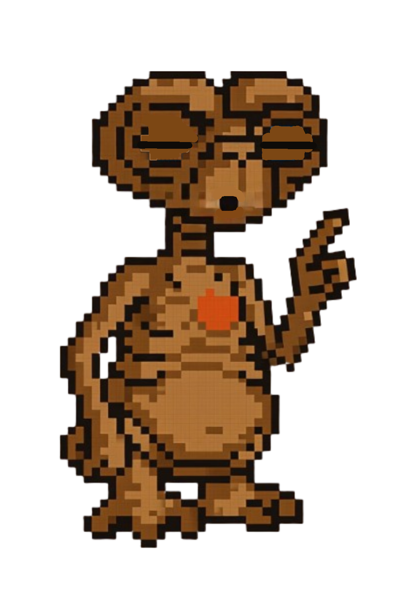

# 🚀 E.T. — The Adventure  Game


**E.T. — The Adventure** is a pixelated browser game inspired by the legendary alien himself. Play as E.T. as he dodges danger, collects power-ups, and races toward the stars — all wrapped in a retro 8-bit style made for nostalgic fun.

---

## 🎨 Pixelated Design

Every visual in this game was handcrafted in a **retro pixel art style** to capture the charm of early 80s games. The background, E.T. sprite, power-ups, and even the evil items falling from the sky were designed to feel like they belong on a vintage arcade screen.

> [!TIP]
> All images are optimized for `image-rendering: pixelated;` to maintain that nostalgic crispness across devices.

---

## 🧹 Gameplay Overview

The goal is simple: **catch helpful items, avoid harmful ones, and level up your XP bar to reach 3000**. Sounds easy? Think again — not everything falling from the sky is your friend...

---

## 🧪 XP Bar

Your current progress is shown in the **XP bar** at the top of the screen:

* Catching **good items** increases your XP.
* Catching **evil items** will set you back!
* Reach **3000 XP** to win the game.

XP progress is visually tracked with a sleek rocket that travels along the XP bar.

---

## 🎨 Power-Ups

### 🚲 Bicycle


* **Effect**: Temporarily boosts E.T.'s speed and sets his feet ablaze with pixelated fire.
* **Duration**: 10 seconds

> [!NOTE]
> When active, a pixel flame animation appears behind E.T.'s legs.

### 🌺 Flowers


* **Effect**: Grants E.T. a glowing shield bubble.
* **Benefit**: Blocks evil items and doubles XP from good ones.
* **Duration**: 10 seconds

> [!TIP]
> A soft blue glow surrounds E.T. while the shield is active.

---

## ✨ All Falling Items

### General Items



* **XP**: +60

### M&Ms 
(because I don't like Reese's)


* **XP**: +30

### Rare Items


* **XP**: +200 and activate power-ups

### Evil Items


* **XP**: -100 (if not shielded)

### Game Over Trigger


* **Effect**: Ends the game instantly if not shielded

> [!WARNING]
> Avoid the eagle at all costs if your shield has expired.

---

## 🔺 Falling Item Statistics

* **General items**: \~40% of all drops
* **MnMs**: \~35%
* **Rare (Power-ups)**: \~10%
* **Evil**: \~10%
* **End-triggering eagle**: \~5%

> [TIP]
> The drop rate is weighted randomly. The rarest item, the eagle, can appear unexpectedly and force a quick reaction!

---

## 👽 E.T. Character Sprites

> [!IMPORTANT]
> E.T.'s figure **mirrors** according to the walking direction.

### Normal State


### Hurt State (after catching evil item)



### Blinking State



### Shielded State

> Surrounded by a glowing bubble, applied via a CSS class: `.shielded`

### Fire (With Bicycle)


> Animated pixel fire placed **behind** the legs using `z-index` layering.

---

## 💬 Text Bubbles & Typing Animation

Dialogue is displayed with a **typewriter effect**, enhancing storytelling moments:

```js
function typeWriterEffect(text, elementId, shouldBubble = false, speed = 100)
```
> [!IMPORTANT]
> Used for: intro message, win message, and dialogue bubbles over E.T.'s head.
> Examples: At the beginning of the game, an `E.T. phone home! Fuel his way back home.` message is presented; when E.T. mistakenly catches an evil item, an `ouch` message is briefly shown. Upon victory, a large success message is finally displayed: `(Be) Good! You got E.T. back home!`

---

## 🚀 Ending Animation

When XP reaches 3000:

1. All falling items **fade out**.
2. A **dark spaceship** slowly descends from the top.
3. A **beam of light** emerges with a reveal animation.
4. E.T. is **faded out** using brightness and opacity filters.
5. The screen displays a celebratory win message:
   **"(Be) Good! You got E.T. back home!"**

> [!NOTE]
> The ending sequence is fully animated and accompanied by sound and visual effects.

---

## 🔍 Legal & Disclaimer

This is a **fan-made project** with no affiliation to Universal Studios or any rights holders of the E.T. franchise.

> **This game is for educational, creative, and entertainment purposes only. No commercial use, profit, or distribution intended.**

All trademarks, characters, and original references to "E.T. the Extra-Terrestrial" belong to their respective owners.

---

## 💻 How to Play

* Use **arrow keys** to move E.T. left and right.
* Catch good items to gain XP.
* Avoid evil items (unless you have the shield!)
* Reach 3000 XP to win the game and see E.T. fly home!

> [!TIP]
> Press the "Pause" button to freeze gameplay and "Resume" to continue.

---

## ✨ Made With Love

This game was coded and designed using **HTML**, **CSS**, and **JavaScript**, and lives on **GitHub Pages**.

---

Want to see the code? [Click here to view the repository](https://aner-sh.github.io/Falling-Items-E.T.-Game/).

Enjoy the ride, and remember: **(Be) Good.**
